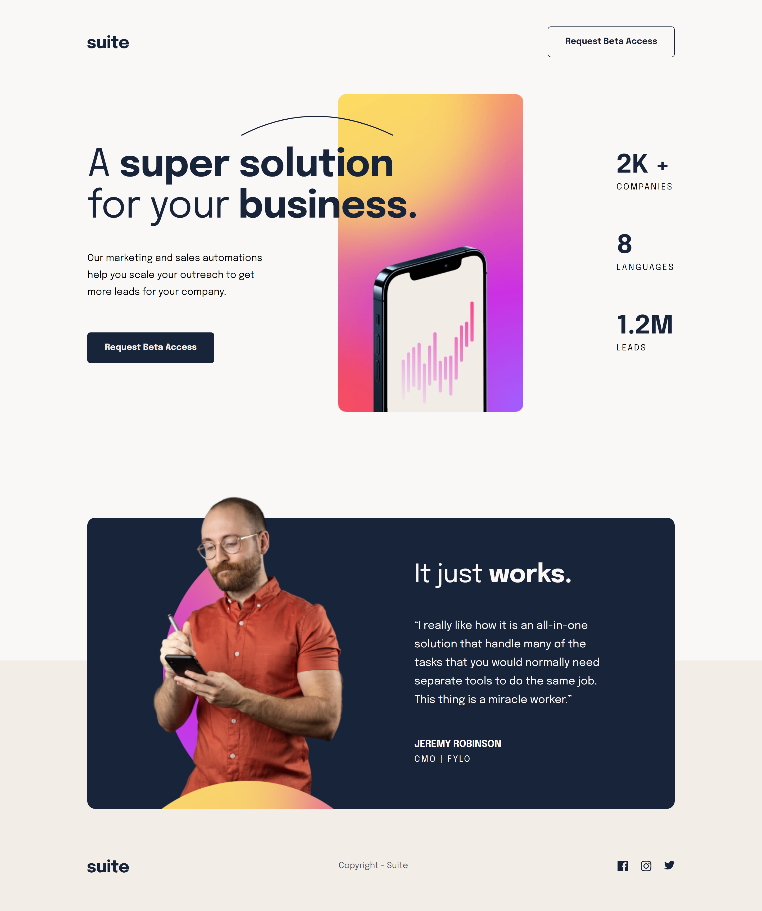

# Frontend Mentor - Suite landing page solution

This is a solution to the [Suite landing page challenge on Frontend Mentor](https://www.frontendmentor.io/challenges/suite-landing-page-tj_eaU-Ra). Frontend Mentor challenges help you improve your coding skills by building realistic projects.

## Table of contents

- [Overview](#overview)
  - [The challenge](#the-challenge)
  - [Screenshot](#screenshot)
  - [Links](#links)
- [My process](#my-process)
  - [Built with](#built-with)
  - [What I learned](#what-i-learned)
  - [Useful resources](#useful-resources)
- [Author](#author)

### Screenshot

### Links

- Solution URL: [Frontend Mentor Solution](https://www.frontendmentor.io/solutions/suita-landing-page-vanilla-css-custom-design-css-animations-Hd-xClrOFQ)
- Live Site URL: [Live Site at Vercel](https://suite-landing-page-seven.vercel.app/)
## My process

### Built with

- Semantic HTML5 markup
- Flexbox
- Grid
- Responsive Design
- CSS Animations
- Media queries

### What I learned

Use better some CSS Animation and use position absolute in many instances without breaking the page layout.

## Author

- Github - [correlucas](https://github.com/correlucas/)
- Frontend Mentor - [@correlucas](https://www.frontendmentor.io/profile/correlucas)
